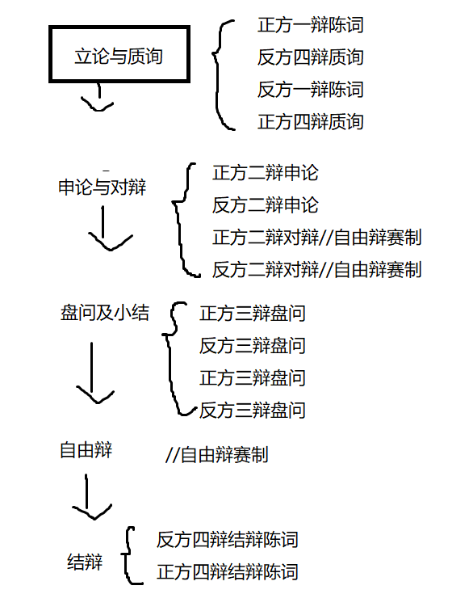

# 白马杯计时器

>【本次的赛制规则】
>大环节一：立论与质询 
>正方一辩 立论陈词 三分钟 180s 
>反方四辩 质询正方一辩 一分半 90s 
>反方一辩 立论陈词 三分钟 180s 
>正方四辩质询反方一辩 一分半 90s 
>大环节二：申论与对辩 
>正方二辩 申论 两分半 150s 
>反方二辩 申论 两分半 150s 
>正方二辩与反方二辩对辩 一分半 90s 
>大环节三：盘问及小结 
>正方三辩盘问反方一二四辩 两分钟 120s 
>反方三辩盘问正方一二四辩 两分钟 120s 
>正方三辩盘问小结 两分钟 120s 
>反方三辩盘问小结 两分钟 120s 
>大环节四：自由辩 
>自由辩论 双方各 4 分钟 
>大环节五：结辩 
>反方四辩 结辩陈词 三分半 210s 
>正方四辩 结辩陈词 三分半 210s 
>总计时： 38.5 分钟 
>【奇袭赛制】每个大环节结束时主席将询问双方是否采用奇袭（所谓大环节是指双 方一辩陈词和质询均结束后、双方二辩申论和对辩均结束后、双方三辩质 询和小结均结束后、双方自由辩均结束后，双方结辩均结束后），决定采用者可示意主席请求发言。奇袭卡于大赛开幕式由各队领队抽取，每队上限4张，奇袭卡内容如下：
>陈词一号卡：己方任意一名辩手陈词2分钟。
>陈词二号卡：指定对方任意一名辩手陈词1分钟后，己方任意一名辩手陈词2分钟。
>质询一号卡：己方任意一名辩手任意盘问对方四位辩手，可指定对方 任意辩手回答。质询方发言时间共计 1 分钟，回答方时间共计 2 分钟。 
>质询二号卡：己方任意一名辩手指定对方一名辩手进行质询，己方发言时间 1 分钟，回答方不计时。质询方可打断被质询方，被质询方不可打断质询方，被质询方只能回答不能反问，被质询方拥有五秒保护时间，保护时间内被质询方不得被打断。
>奇袭卡每个队伍每场比赛使用上限为2张，本场比赛中使用过的奇袭卡在比赛结束后交由本场比赛的主席，不可重复利用。
>——————————————————————————
>这个计时器是选手们比赛的时候，显示在学校教室里那个大屏幕上的，辩手们也会看。
>计时员会在屏幕上点点点然后计时，为了保证又准确又及时，当时是计时员每个人都带了鼠标插讲台上操控那个网页。
>希望这次的计时器能让计时员在大屏幕上用指头戳就能很方便地给正反方交替计时、开启新环节、使用奇袭卡，不需要在屏幕周围跑来跑去。√
>去年辩手们用奇袭卡的时候我们都得开贼多的网页准备着，这次希望能整合一下√
>希望是离线的√学校那个大电脑上很容易就搞上去的√
------
好了以上是要求x
下面是关于怎么实现的笔记

## 基本流程

## 页面结构

- 计时器
- 赛程显示/翻页/奇袭卡发动

<!--施工中-->